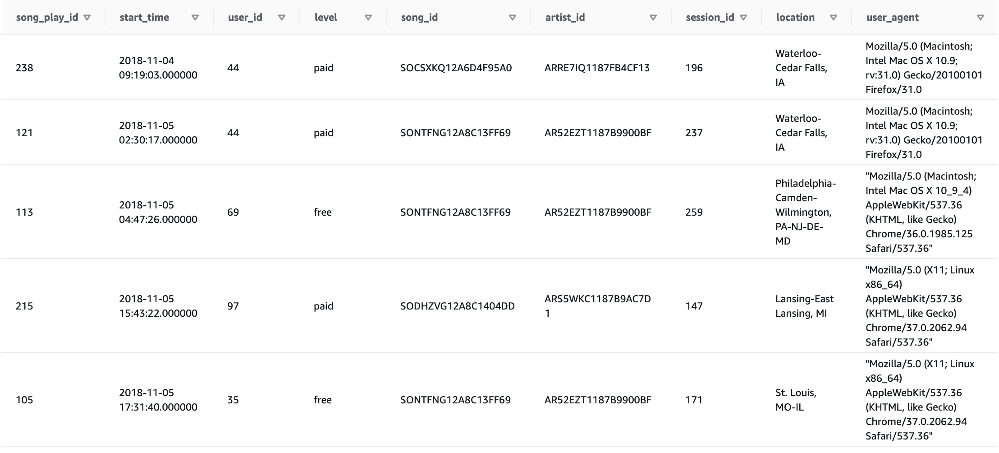

# Project Summary:
In this project we build an ETL pipeline to enable Sparkify to move their processes and data to cloud using AWS.
We create Redshift cluster with the user AWS credentials, load the data from S3 to staging tables in Redshift and then execute SQL statements to create our fact and dimensions table in Redshift

---

**Fact table:**
- songplays (song_play_id as PRIMARY KEY and contains columns of all Dimension table PRIMARY KEYS. This Star schema makes it easy to query data). In addition, We use start_time column as SORTKEY to sort data by time and use song_id as DISTKEY

**Dimension table:**
- users    (user_id as PRIMARY KEY and DISTSTYLE ALL since it is a small table)
- songs    (song_id as PRIMARY KEY and DISTKEY song_id same as Fact table)
- artists  (artist_id as PRIMARY KEY and DISTSTYLE ALL since it is a small table)
- time     (start_time as PRIMARY KEY and DISTSTYLE ALL since it is a small table)

---

# Explanation of Files in the Repository:
- **create_delete_cluster.py** 
-- Imports relevant libraries
-- Reads the config files for credentials
-- Creates clients for IAM, EC2, S3 and Redshift
-- Defines functions to Create IAM Role, Redshift cluster and to Delete Cluster and Resources

- **create_tables.py** is a python scripts which connects to AWS database and clusters and then executes the CREATE and DROP table queries for all the tables in our Sparkify database. These tables are defined in the **sql_queries.py** script
- **sql_queries.py** is a python script which executes all the SQL statemnts such as DROP TABLES , CREATE TABLES COPY STAGING TABLES and INSERT INTO TABLES. This script contains all the fact and dimensions table defined above as well as staging tables copied from S3 and sets up all the column names, their data types and PRIMARY KEYS
- **etl.py** Is a python script which load data from S3 buckets to Redshift and then uses it to INSERT data using queries from staging tables to the dimension and fact tables

---

# Running Scripts:
**RunningScripts.ipynb** Is the Jupyter notebook which is used to call and run all the scripts. It contains steps and well commented sections on performing the entire ETL process described above, including creating clusters, defining tables schema, loading staging tables, executing SQL to create analytical tables and finally deleting the clusters and resources at the end of session

# Below are the first few lines of the tables created
**SONG TABLE**

**ARTIST TABLE**

**USER TABLE**

**TIMESTAMP TABLE**

**SONGPLAY TABLE**

